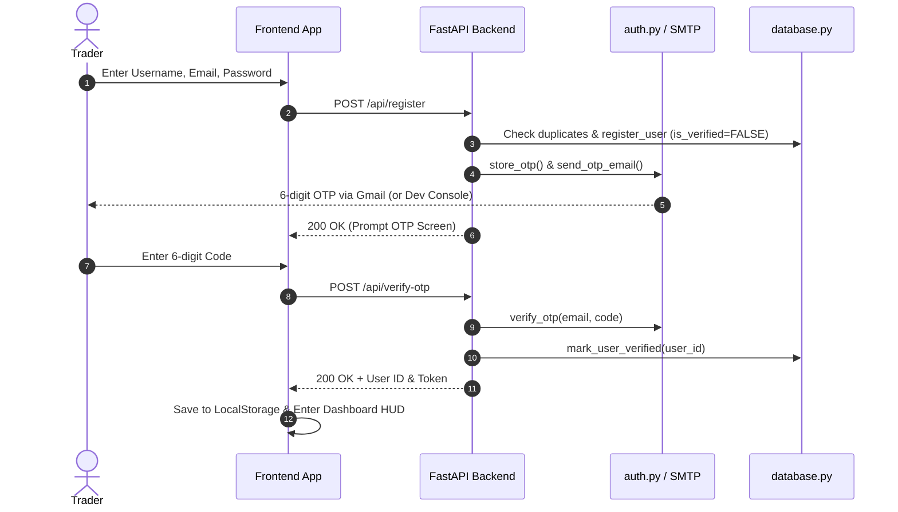
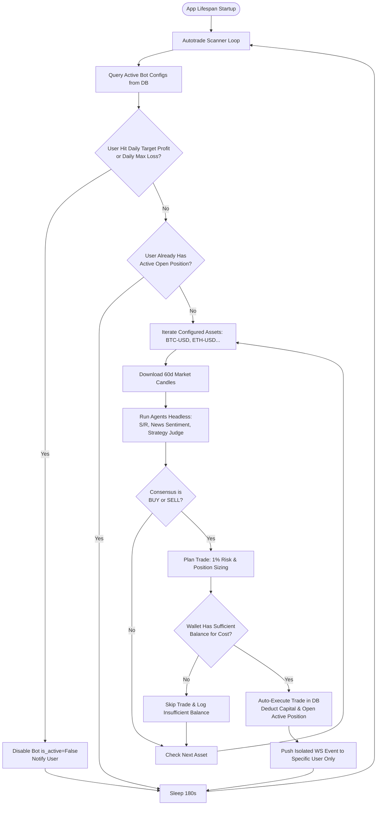

# Orbit (Aether) Trading Terminal — Complete System Documentation

---

## Table of Contents
1. [Executive Summary](#1-executive-summary)
2. [Technology Stack](#2-technology-stack)
3. [System Architecture](#3-system-architecture)
4. [Directory & File Structure](#4-directory--file-structure)
5. [The 12-Agent Intelligence Engine](#5-the-12-agent-intelligence-engine)
6. [The 12 Quantitative Trading Strategies](#6-the-12-quantitative-trading-strategies)
7. [Database Architecture & Data Models](#7-database-architecture--data-models)
8. [API & WebSocket Protocol Reference](#8-api--websocket-protocol-reference)
9. [Core System Workflows](#9-core-system-workflows)
10. [Risk Management & Order Execution](#10-risk-management--order-execution)
11. [Performance Analytics & Reporting Engine](#11-performance-analytics--reporting-engine)
12. [Frontend Architecture & Visual HUD](#12-frontend-architecture--visual-hud)
13. [Configuration & Environment Variables](#13-configuration--environment-variables)
14. [Setup, Deployment & Testing Guide](#14-setup-deployment--testing-guide)

---

## 1. Executive Summary

**Orbit Trading Terminal** (internally branded **Aether 12-Agent Terminal**) is an institutional-grade autonomous trading simulator and multi-agent AI research platform. It continuously processes real-time and historical multi-asset market data (Crypto, US Equities, Indian NSE/BSE Equities, Indices, and Forex) through a coordinated pipeline of **12 specialized quantitative and artificial intelligence agents**.

### Key System Capabilities
* **Multi-Agent Consensus**: Blends 12 mathematical quantitative strategies (SMC, ICT, Wyckoff, Price Action, Supply/Demand, Trend Following, Bollinger Breakouts, Fibonacci, CVD Order Flow, Z-Score Mean Reversion, SuperTrend, HMA) with upstream specialist signals (Momentum Bar, EMA Ribbon, Volatility Squeeze, Volume Flow, Multi-Timeframe Alignment).
* **LLM Failover Engine**: Resilient multi-provider AI integration (Google Gemini & Groq Cloud) featuring automatic key pooling, round-robin load distribution, retirement fallback, and deterministic NLP sentiment scoring.
* **Dual Persistence Layer**: Dynamic database support for cloud PostgreSQL (Neon serverless) and local zero-config SQLite with automated table migrations.
* **Risk & Position Governance**: Strict $1.0\%$ equity risk cap, $1:2$ fixed risk-to-reward ratio, sentiment vetoes, automatic break-even trailing stop adjustments at $+1.5\%$ profit, and stale order drift cancelation.
* **Autonomous Auto-Trading Daemon**: Background market scanning daemon executing headless agent evaluations every 180 seconds across custom asset baskets with automated profit targets and daily loss cutoffs.
* **Institutional Performance Reporting**: Mathematical analytics computing Win Rate, Profit Factor, Expectancy, and Maximum Drawdown paired with handcrafted inline SVG visualizations (Equity Curves, P&L Distributions, Asset/Monthly breakdowns) and export capabilities (CSV, JSON, PDF).
* **Next-Gen Cyberpunk Interface**: Three.js WebGL 3D animated market floor and neon candlestick graphs, embedded TradingView workspace, and custom HTML5 2D canvas overlays for real-time support/resistance and profit/loss target zones.

---

## 2. Technology Stack

### Backend
| Technology | Version / Requirement | Role in System |
|---|---|---|
| **Python** | `3.10+` | Core backend runtime |
| **FastAPI** | `>=0.115.0` | High-performance ASGI REST endpoints & native WebSocket server |
| **Uvicorn** | `>=0.30.0` | Production ASGI web server |
| **yfinance** | `>=0.2.40` | Market data ingestion (OHLCV candles for Crypto, US/Indian Stocks, Forex) |
| **Pandas & NumPy** | `>=2.0.0` / `>=1.24.0` | Vectorized indicator calculations, matrix math, resampling |
| **Google GenAI SDK** | `>=1.0.0` | Primary LLM provider for contextual market reasoning & sentiment |
| **Groq Cloud API** | REST via `urllib` | High-speed secondary/failover LLM provider |
| **PostgreSQL / psycopg2** | `>=2.9.6` | Cloud relational database for production deployments |
| **SQLite3** | Standard Library | Zero-config embedded local database fallback |
| **WebSockets** | `>=12.0` | Bi-directional streaming for live ticks, logs, metrics & alerts |
| **smtplib / email** | Standard Library | Automated 6-digit OTP verification emails via Gmail SMTP |

### Frontend
| Technology | Role in System |
|---|---|
| **Vanilla JavaScript (ES6+)** | Lightweight state management, WebSocket client, event dispatching |
| **Three.js (r128 / r185)** | 3D WebGL background scene: 2000-particle floor, market dust, neon candlestick models |
| **TradingView Widget (`tv.js`)** | Interactive technical charting with multi-timeframe & global symbol support |
| **HTML5 2D Canvas** | Dynamic overlays: S/R zones, liquidity stop pools, green/red trade projection boxes |
| **Inline SVG Engine** | Responsive data visualization for equity curves, bar charts, and donut rings |
| **Vanilla CSS3** | Glassmorphic dark UI, CSS Grid & Flexbox layouts, responsive design tokens |
| **Google Fonts & FontAwesome** | Typography (`Inter`, `JetBrains Mono`) and iconography (FontAwesome 6.4.0) |

---

## 3. System Architecture

```
                                  ┌─────────────────────────────────────────────────────────┐
                                  │                     CLIENT BROWSER                      │
                                  │  Three.js 3D WebGL • TradingView Embed • Canvas Overlay │
                                  │     Vanilla JS HUD • Live Metrics • SVG Analytics       │
                                  └───────────────────────────▲─────────────────────────────┘
                                                              │
                                            HTTP (REST) / WebSocket (Duplex JSON)
                                                              │
                                  ┌───────────────────────────▼─────────────────────────────┐
                                  │               FASTAPI ASYNC BACKEND CORE                │
                                  │             (backend/main.py, auth.py)                 │
                                  └───────────────▲─────────────────────────▲───────────────┘
                                                  │                         │
                   ┌──────────────────────────────┴──────────┐   ┌──────────┴──────────────────────────────┐
                   │        12-AGENT DECISION ENGINE         │   │         DATABASE & PERSISTENCE          │
                   │    (backend/agents/*.py, llm.py)        │   │        (backend/database.py)            │
                   ├─────────────────────────────────────────┤   ├─────────────────────────────────────────┤
                   │ 1. Levels Analyst (S/R & Liquidity)     │   │ • PostgreSQL / Neon DB (Production)     │
                   │ 2. Indicator Analyst (RSI/MACD/EMA)     │   │ • SQLite3 fallback (trading_sim.db)     │
                   │ 3. News Analyst (Gemini/Groq + Lexicon) │   │ • Multi-user isolated balances & trades │
                   │ 4. Momentum Candle Analyst (Big Bar)    │   │ • Bot configuration & state tables      │
                   │ 5. EMA Ribbon Analyst (5/9/15)          │   └─────────────────────────────────────────┘
                   │ 6. Volatility Analyst (ATR/BB Squeeze)  │
                   │ 7. Volume Flow Analyst (OBV/VWAP)       │   ┌─────────────────────────────────────────┐
                   │ 8. MTF Trend Analyst (Weekly vs Daily)  │   │          EXTERNAL INTEGRATIONS          │
                   │ 9. Strategy Judge (12 Quant Strats)     │   ├─────────────────────────────────────────┤
                   │ 10. Risk Planner (1:2 RR, Sizing)       │   │ • Market Data: Yahoo Finance (yfinance) │
                   │ 11. Execution Agent (Order Desk)        │   │ • News: NewsAPI.org & Yahoo RSS         │
                   │ 12. Portfolio Monitor (Break-Even/SL)   │   │ • LLMs: Google Gemini & Groq Cloud      │
                   └─────────────────────────────────────────┘   │ • Auth: Gmail SMTP (TLS 465)            │
                                                                 └─────────────────────────────────────────┘
```

---

## 4. Directory & File Structure

```
testttai/
├── backend/
│   ├── agents/
│   │   ├── chart_analyst.py            # Agent 1: S/R levels & liquidity zones
│   │   ├── indicator_analyst.py        # Agent 2: RSI, MACD, 50/200 EMA trend
│   │   ├── news_analyst.py             # Agent 3: Live news ingestion & sentiment scoring
│   │   ├── momentum_candle_analyst.py  # Agent 4: Big bar & candle price action
│   │   ├── ema_ribbon_analyst.py       # Agent 5: Fast 5/9/15 EMA ribbon & crossovers
│   │   ├── volatility_analyst.py       # Agent 6: ATR & Bollinger squeeze regime
│   │   ├── volume_flow_analyst.py      # Agent 7: OBV, rolling VWAP, volume divergence
│   │   ├── mtf_trend_analyst.py        # Agent 8: Multi-timeframe weekly/daily alignment
│   │   ├── strategy_judge.py           # Agent 9: 12-strategy consensus judge & LLM synthesis
│   │   ├── risk_planner.py             # Agent 10: Position sizing, SL/TP levels & sentiment veto
│   │   ├── execution_agent.py          # Agent 11: Pending order desk & drift cancelation
│   │   └── portfolio_monitor.py        # Agent 12: Active P&L manager & break-even SL
│   ├── auth.py                         # Password hashing, OTP generation & SMTP delivery
│   ├── database.py                     # Dual-backend DB (Postgres/SQLite), CRUD, ledger
│   ├── llm.py                          # Dual-provider LLM failover engine (Gemini/Groq)
│   ├── main.py                         # FastAPI app, REST APIs, WS hub & auto-trader
│   ├── reporting.py                    # Math engine for equity curve, drawdown, KPIs
│   ├── requirements.txt                # Python backend dependencies
│   └── trading_sim.db                  # Local SQLite database instance
├── frontend/
│   ├── app.js                          # Client state manager, WebSocket client, UI controller
│   ├── index.html                      # Landing page, auth modals, trading terminal HUD
│   ├── style.css                       # Complete CSS design system & responsive styling
│   └── three-scene.js                  # Three.js 3D WebGL background scene controller
├── Dockerfile                          # Production container build
├── docker-compose.yml                  # Multi-container service configuration
├── package.json                        # Node workspace & dependency metadata
├── test_pipeline.py                    # Direct backend agent verification test script
└── test_ws.py                          # WebSocket integration testing utility
```

---

## 5. The 12-Agent Intelligence Engine

```
                                    ┌────────────────────────┐
                                    │    Market OHLCV Data   │
                                    │   (Yahoo Finance 60d)  │
                                    └───────────┬────────────┘
                                                │
          ┌─────────────────────────────────────┼─────────────────────────────────────┐
          │                                     │                                     │
┌─────────▼───────────┐               ┌─────────▼───────────┐               ┌─────────▼───────────┐
│ 1. Levels Analyst   │               │ 2. Indicator Analyst│               │ 3. News Analyst     │
│ S/R Clusters + Liq  │               │ RSI, MACD, 50/200EMA│               │ NewsAPI/RSS/Gemini  │
└─────────┬───────────┘               └─────────┬───────────┘               └─────────┬───────────┘
          │                                     │                                     │
          ├─────────────────────────────────────┼─────────────────────────────────────┤
          │                                     │                                     │
┌─────────▼───────────┐               ┌─────────▼───────────┐               ┌─────────▼───────────┐
│ 4. Momentum Candle  │               │ 5. EMA Ribbon       │               │ 6. Volatility       │
│ Big Bar / Engulfing │               │ 5/9/15 Stacking     │               │ ATR/BB Squeeze      │
└─────────┬───────────┘               └─────────┬───────────┘               └─────────┬───────────┘
          │                                     │                                     │
          ├─────────────────────────────────────┼─────────────────────────────────────┤
          │                                     │                                     │
┌─────────▼───────────┐               ┌─────────▼───────────┐                         │
│ 7. Volume Flow      │               │ 8. MTF Trend        │                         │
│ OBV, VWAP, Delta    │               │ Weekly vs Daily EMA │                         │
└─────────┬───────────┘               └─────────┬───────────┘                         │
          │                                     │                                     │
          └──────────────────┬──────────────────┴─────────────────────────────────────┘
                             │
                  ┌──────────▼──────────┐
                  │ 9. Strategy Judge   │◄─── Evaluates 12 Quantitative Strategies + Specialists
                  │ Consensus Verdict   │
                  └──────────┬──────────┘
                             │
                  ┌──────────▼──────────┐
                  │ 10. Risk Planner    │◄─── 1% Capital Risk, 1:2 R:R, SL/Target, Sentiment Veto
                  │ Setup Specification │
                  └──────────┬──────────┘
                             │
                             ├───────────────────────────────────────┐
                             │                                       │
                  ┌──────────▼──────────┐                 ┌──────────▼──────────┐
                  │ 11. Execution Agent │                 │ 12. Portfolio Guard │
                  │ Pending Order Desk  │                 │ Active P&L & BE SL  │
                  └─────────────────────┘                 └─────────────────────┘
```

### Detailed Agent Specifications

#### 1. Levels Analyst (`backend/agents/chart_analyst.py`)
* **Objective**: Locates key structural support and resistance levels and computes institutional liquidity pools.
* **Algorithm**:
  1. Detects local extrema over a rolling window $w=5$:
     $$L_i = \min(L_{i-w \dots i+w}), \quad H_i = \max(H_{i-w \dots i+w})$$
  2. Clusters levels within a $1.5\%$ proximity threshold:
     $$\frac{|P - \bar{P}_{\text{cluster}}|}{\bar{P}_{\text{cluster}}} < 0.015$$
  3. Computes sell-side liquidity ($0.998 \times \text{Support}$) and buy-side liquidity ($1.002 \times \text{Resistance}$).

#### 2. Indicator Analyst (`backend/agents/indicator_analyst.py`)
* **Objective**: Calculates standard momentum oscillators and macro trend structure.
* **Formulas**:
  * **Wilder's RSI (14-period)**:
    $$RS = \frac{\text{EMA}_{14}(\text{Gain}, \alpha=1/14)}{\text{EMA}_{14}(\text{Loss}, \alpha=1/14)}, \quad RSI = 100 - \frac{100}{1 + RS}$$
  * **MACD (12, 26, 9)**:
    $$\text{MACD Line} = \text{EMA}_{12}(\text{Close}) - \text{EMA}_{26}(\text{Close}), \quad \text{Signal Line} = \text{EMA}_{9}(\text{MACD Line})$$
  * **Macro Trend**: Price alignment relative to 50 and 200 EMAs.

#### 3. News Analyst (`backend/agents/news_analyst.py`)
* **Objective**: Evaluates market sentiment score $S \in [-1.0, +1.0]$.
* **Execution**:
  * Scrapes NewsAPI.org $\rightarrow$ Yahoo Finance RSS $\rightarrow$ Fallback simulated feeds.
  * Contextual LLM evaluation (Gemini/Groq) scoring aggregate market tone.
  * Deterministic fallback using financial sentiment lexicons (`BULLISH_WORDS` vs `BEARISH_WORDS`).

#### 4. Momentum Candle Analyst (`backend/agents/momentum_candle_analyst.py`)
* **Objective**: Identifies institutional "Big Bars" and decisive candlestick formations.
* **Rules**:
  * **Big Bar**: True Range $\ge 1.5 \times \text{ATR}(14)$.
  * **Marubozu**: Candle body $\ge 70\%$ of total high-low range.
  * **Pin Bar Rejection**: Shadow length $\ge 60\%$ of total range.
  * **Volume Confirmation**: Volume $\ge 1.3 \times \text{20-bar average volume}$.

#### 5. EMA Ribbon Analyst (`backend/agents/ema_ribbon_analyst.py`)
* **Objective**: Evaluates fast trend stacking and generates precision entry triggers.
* **Signals**:
  * **Bullish Ribbon**: $\text{EMA}_5 > \text{EMA}_9 > \text{EMA}_{15}$.
  * **Bearish Ribbon**: $\text{EMA}_5 < \text{EMA}_9 < \text{EMA}_{15}$.
  * **Fresh Cross**: $\text{EMA}_5 \times \text{EMA}_9$ crossover occurred within the last 3 candles.
  * **Compression**: Ribbon width $< 0.4\%$ of price (consolidation squeeze).

#### 6. Volatility Analyst (`backend/agents/volatility_analyst.py`)
* **Objective**: Determines volatility regime and adjusts risk parameters.
* **Regime Classification**:
  * Evaluates Bollinger Bandwidth across a 100-bar rolling window.
  * $\le 25\text{th}$ percentile $\rightarrow$ `SQUEEZE` (Multiplier: $0.8\times$).
  * $\ge 75\text{th}$ percentile $\rightarrow$ `EXPANSION` (Multiplier: $1.6\times$).
  * Otherwise $\rightarrow$ `NORMAL` (Multiplier: $1.0\times$).

#### 7. Volume Flow Analyst (`backend/agents/volume_flow_analyst.py`)
* **Objective**: Validates order flow and detects divergence.
* **Metrics**:
  * **OBV Accumulation / Distribution**: 10-bar slope of On-Balance Volume.
  * **Rolling VWAP (20-bar)**: Price position relative to Volume-Weighted Average Price.
  * **Divergence**: Price making new 20-bar highs without confirmation from OBV (exhaustion warning).

#### 8. MTF Trend Analyst (`backend/agents/mtf_trend_analyst.py`)
* **Objective**: Gating trade direction against the higher timeframe.
* **Execution**: Resamples daily candles to weekly (`'W'`) and compares weekly 10/30 EMA alignment with daily 20/50 EMA alignment. Conflicting timeframes reduce confidence to stand aside.

#### 9. Strategy Judge (`backend/agents/strategy_judge.py`)
* **Objective**: Evaluates 12 quantitative institutional strategies plus specialist agent confluence votes.
* **Decision Rule**: Requires at least $\ge 2$ net confirming directional votes to form a `"buy"` or `"sell"` consensus. Synthesizes market reasoning via Gemini/Groq LLMs.

#### 10. Risk Planner (`backend/agents/risk_planner.py`)
* **Objective**: Formulates execution orders, computes capital allocation, and verifies sentiment compatibility.
* **Rules**:
  * **Sentiment Veto**: Rejects BUY signals if News Sentiment $<-0.30$; rejects SELL signals if News Sentiment $>+0.30$.
  * **Risk Allocation**: Risks exactly $1.0\%$ of wallet balance per trade.
  * **Position Sizing**:
    $$\text{Quantity} = \min\left(\frac{\text{Wallet Balance} \times 0.01}{|\text{Entry} - \text{SL}|}, \frac{\text{Wallet Balance}}{\text{Entry}}\right)$$
  * **Target**: Configured at a strict $1:2$ Risk-to-Reward ratio ($RR = 2.0$).

#### 11. Execution Agent (`backend/agents/execution_agent.py`)
* **Objective**: Order-desk manager monitoring pending unconfirmed trades.
* **Protections**: Automatically cancels orders if market price drifts $>2.0\%$ away from entry or trades through the stop loss before execution.

#### 12. Portfolio Monitor (`backend/agents/portfolio_monitor.py`)
* **Objective**: Active trade manager and exit execution engine.
* **Features**:
  * Computes mark-to-market unrealized P&L every tick.
  * **Break-Even Stop**: Automatically moves Stop Loss to entry price when position profit reaches $\ge +1.5\%$.
  * Executes SL/Target fills, credits realized P&L to wallet balance, and updates historical ledger.

---

## 6. The 12 Quantitative Trading Strategies

The Strategy Judge (`backend/agents/strategy_judge.py`) runs 12 institutional strategies on every evaluation cycle:

| # | Strategy Name | Core Mathematical / Technical Logic | Trigger Conditions |
|---|---|---|---|
| **1** | **Smart Money Concepts (SMC)** | Break of Structure (BOS) + Fair Value Gap (FVG) | Price breaks 20-period swing high/low with a 3-candle imbalance gap |
| **2** | **ICT Strategy** | Market Structure Shift (MSS) on High Volume + FVG | 20-period BOS accompanied by $>1.3\times$ volume and FVG retracement |
| **3** | **Wyckoff Method** | Accumulation Spring / Distribution Upthrust | False breakdown/breakout of a 30-bar range with sudden volume reversal |
| **4** | **Price Action** | Rejection Pin Bars & Engulfing at S/R | Hammer/Shooting Star Pin bar within 1.5% of S/R, or Engulfing candle |
| **5** | **Supply & Demand** | Fresh Base Retracement | Price returning into a high-momentum historical base (15-candle lookback) |
| **6** | **Trend Following** | 4-EMA Ribbon Alignment with ADX Filter | $\text{EMA}_9 > \text{EMA}_{21} > \text{EMA}_{50} > \text{EMA}_{200}$ with pullback to $\text{EMA}_{21}$ and $\text{ADX} > 22$ |
| **7** | **Breakout Strategy** | Bollinger Band Volatility Expansion | Price closing outside 20-bar Bollinger Band on $>1.3\times$ volume |
| **8** | **Fibonacci Strategy** | Golden Pocket Retracement | Price bouncing between 50.0% and 61.8% Fibonacci retracement of 40-bar swing |
| **9** | **Order Flow** | Cumulative Volume Delta (CVD) Divergence | 20-period CVD trend divergence against recent price extremes |
| **10** | **Quantitative Mean Reversion** | Statistical Z-Score Extreme | Price Z-Score $>+2.0\sigma$ (Short) or $<-2.0\sigma$ (Long) from 20-period SMA |
| **11** | **SuperTrend Trend Following** | ATR-based Adaptive Trend Trailing | 10-period ATR with $2.0\times$ multiplier trailing band flip |
| **12** | **Hull Moving Average (HMA)** | Fast HMA Momentum Crossover | Fast HMA (9) crossing Slow HMA (21) |

---

## 7. Database Architecture & Data Models

The persistence layer (`backend/database.py`) automatically routes queries to **PostgreSQL** (when `DATABASE_URL` is configured) or embedded **SQLite3** (`trading_sim.db`).

```
┌───────────────────────────────────────┐
│                "user"                 │
├───────────────────────────────────────┤
│ id (PK): SERIAL / INTEGER             │
│ username: VARCHAR(255) / TEXT (UNIQUE)│
│ email: VARCHAR(255) / TEXT (UNIQUE)   │
│ password_hash: VARCHAR(255) / TEXT    │
│ is_verified: BOOLEAN / INTEGER        │
│ balance: DOUBLE PRECISION / REAL      │
└──────────────────┬────────────────────┘
                   │
                   ├────────────────────────────────────────┐
                   │ 1                                      │ 1
                   ▼ *                                      ▼ 1
┌───────────────────────────────────────┐  ┌───────────────────────────────────────┐
│                trades                 │  │              bot_config               │
├───────────────────────────────────────┤  ├───────────────────────────────────────┤
│ id (PK): SERIAL / INTEGER             │  │ id (PK): SERIAL / INTEGER             │
│ user_id (FK): INTEGER                 │  │ user_id (FK): INTEGER (UNIQUE)        │
│ asset: VARCHAR(50) / TEXT             │  │ assets: TEXT                          │
│ type: VARCHAR(10) / TEXT (buy/sell)   │  │ total_capital: DOUBLE PRECISION / REAL│
│ quantity: DOUBLE PRECISION / REAL     │  │ max_risk_per_trade: DOUBLE PRECISION  │
│ entry_price: DOUBLE PRECISION / REAL  │  │ min_profit_target: DOUBLE PRECISION   │
│ current_price: DOUBLE PRECISION / REAL│  │ max_profit_target: DOUBLE PRECISION   │
│ exit_price: DOUBLE PRECISION / REAL   │  │ is_active: BOOLEAN / INTEGER          │
│ sl: DOUBLE PRECISION / REAL           │  └───────────────────────────────────────┘
│ target: DOUBLE PRECISION / REAL       │
│ pnl: DOUBLE PRECISION / REAL          │
│ status: VARCHAR(20) / TEXT            │
│ outcome: VARCHAR(20) / TEXT           │
│ timestamp: VARCHAR(50) / TEXT         │
└───────────────────────────────────────┘
```

---

## 8. API & WebSocket Protocol Reference

### REST Endpoints

#### Authentication & User Management
* **`POST /api/register`**
  * Body: `{"username": "str", "email": "str", "password": "str"}`
  * Returns: `{"ok": true, "message": "Account created. Check email for OTP."}`
* **`POST /api/verify-otp`**
  * Body: `{"email": "str", "otp": "str"}`
  * Returns: `{"ok": true, "user_id": int, "username": "str"}`
* **`POST /api/login`**
  * Body: `{"username": "str", "password": "str"}`
  * Returns: `{"ok": true, "user_id": int, "username": "str"}`
* **`POST /api/resend-otp`**
  * Body: `{"email": "str"}`
  * Returns: `{"ok": true, "message": "New OTP sent."}`

#### Market News
* **`GET /api/news?symbol=BTC-USD`**: Returns news articles tagged with sentiment scores for a specific ticker.
* **`GET /api/news/global`**: Ingests broad global macroeconomic news for dashboard feeds.

#### Bot Configuration & Performance Reports
* **`GET /api/bot-config?user_id=1`**: Retrieves auto-trade configuration for user.
* **`POST /api/bot-config`**: Updates auto-trade parameters (assets, capital, profit/loss cutoffs, active state).
* **`GET /api/report?user_id=1`**: Returns JSON performance report (KPIs, equity curve points, breakdowns).
* **`GET /api/report/export.csv?user_id=1`**: Streams complete trade ledger as a CSV attachment.

---

### WebSocket Protocol (`/ws`)

* **Endpoint**: `ws://<host>:8000/ws?user_id=<id>&username=<name>`
* **Architecture**: Managed by `ConnectionManager` with per-socket asynchronous FIFO message queues to guarantee thread-safe in-order message delivery.

#### Client Actions (Inbound)
```json
// 1. Start live analysis pipeline
{ "action": "start", "asset": "BTC-USD" }

// 2. Stop pipeline
{ "action": "stop" }

// 3. Confirm trade execution
{ "action": "confirm_trade", "trade_id": 14 }

// 4. Cancel pending trade
{ "action": "cancel_trade" }
```

#### Server Events (Outbound)
* `history`: Initial 60-day historical daily candles.
* `tick`: Real-time simulated price update candle (every 4 seconds).
* `levels`: Calculated support levels, resistance levels, and liquidity zones.
* `metrics`: Technical oscillator values, sentiment score, and 12-strategy consensus vote tallies.
* `signal`: New actionable trade setup requiring confirmation.
* `log`: Operations log line from an individual agent (`agent`, `message`, `time`).
* `wallet`: Current available cash balance in INR.
* `positions`: Active and pending trades array.
* `history_trades`: List of closed historical trades.
* `system_status`: System running status (`"running"`, `"standby"`, `"offline"`).

---

## 9. Core System Workflows

### 1. User Registration & OTP Verification



---

### 2. Manual Trade Analysis & Execution Pipeline

```mermaid
sequenceDiagram
    autonumber
    actor User as Trader
    participant UI as Frontend Terminal
    participant WS as WebSocket Handler
    participant YF as Yahoo Finance (yfinance)
    participant Pipe as 12-Agent Pipeline
    participant DB as database.py

    User->>UI: Select Asset (e.g. BTC-USD) & Click "Initialize AI Crew"
    UI->>WS: send({ action: "start", asset: "BTC-USD" })
    WS->>YF: Download 60-day historical daily candles
    WS->>UI: emit "history" (candles) + emit "wallet"
    
    rect rgb(20, 25, 40)
        Note over WS,Pipe: Sequential 12-Agent Processing
        WS->>Pipe: Levels Analyst -> find_support_resistance()
        Pipe-->>UI: emit "levels" (draws S/R on canvas)
        WS->>Pipe: Indicator Analyst -> RSI / MACD / EMAs
        WS->>Pipe: News Analyst -> Live Headings + Gemini Sentiment
        WS->>Pipe: Specialists -> Momentum, Ribbon, Volatility, Flow, MTF
        WS->>Pipe: Strategy Judge -> 12 Quant Strategies Consensus
        Pipe-->>UI: emit "metrics" (update gauges & consensus)
        WS->>Pipe: Risk Planner -> plan_trade()
    end

    alt Consensus is BUY or SELL
        Pipe->>DB: create_pending_trade()
        WS->>UI: emit "signal" (Open Trade Confirmation Modal)
        User->>UI: Click "Place Trade" (Confirm)
        UI->>WS: send({ action: "confirm_trade", trade_id })
        WS->>DB: execute_trade() (Deduct cost, mark status='active')
        WS->>UI: emit "positions" & emit "wallet"
    else Consensus is HOLD
        Pipe-->>UI: Log: System is currently holding
    end

    loop Live Simulation Loop (Every 4s)
        WS->>WS: Generate realistic random walk tick
        WS->>UI: emit "tick"
        WS->>Pipe: Portfolio Monitor -> check break-even & target/SL hits
        opt Hit +1.5% Profit
            Pipe->>DB: Move SL to Entry (Break-even locked)
        end
        opt Hit SL or Target
            Pipe->>DB: close_trade() (Credit refund + PnL, mark status='closed')
            WS->>UI: emit "wallet", "positions", "history_trades"
        end
    end
```



---

### 3. Background Autonomous Auto-Trade Loop



---

## 10. Risk Management & Order Execution

### Risk Constraints
* **Max Risk per Trade**: Capped at $1.0\%$ of available wallet equity.
* **Fixed Risk-to-Reward**: Target distance is always $2.0\times$ Stop-Loss distance ($1:2$ RR).
* **Capital Protection Filter**: Orders requiring more capital than available wallet balance are rejected.
* **Stop Drift Invalidation**: If market price moves $>2.0\%$ away from planned entry before trader confirmation, the order is automatically canceled as stale.
* **Break-Even Trailing**: Once an active trade gains $\ge +1.5\%$, Stop Loss is moved to Entry Price ($0.0$ risk).

---

## 11. Performance Analytics & Reporting Engine

The reporting engine (`backend/reporting.py`) performs pure mathematical evaluation over the chronological trade record:

1. **Win Rate ($WR$)**:
   $$WR = \left(\frac{\text{Total Winning Trades}}{\text{Total Closed Trades}}\right) \times 100$$
2. **Profit Factor ($PF$)**:
   $$PF = \frac{\sum \text{Gross Realized Profits}}{\left|\sum \text{Gross Realized Losses}\right|}$$
3. **Expectancy ($E$)**:
   $$E = \frac{\text{Net Realized P\&L}}{\text{Total Closed Trades}}$$
4. **Maximum Drawdown ($MDD$)**: Deepest peak-to-trough decline of cumulative equity curve:
   $$\text{Drawdown}_t = \max_{0 \le \tau \le t}(\text{Equity}_\tau) - \text{Equity}_t, \quad MDD = \max_{t}(\text{Drawdown}_t)$$
5. **Streaks**: Tracks longest consecutive winning and losing runs.

---

## 12. Frontend Architecture & Visual HUD

* **Interactive 3D WebGL Canvas (`three-scene.js`)**: Runs a Three.js scene featuring 2,000 animated floor particles with HSL color gradients, 350 floating dust particles, and 24 volumetric 3D candlesticks with dynamic camera panning keyed to window scroll.
* **TradingView Workspace (`app.js`)**: Embedded widget supporting symbol search across crypto, US equities, Indian equities, and forex.
* **Canvas Overlay Layer**: Draws Support/Resistance bands, Liquidity pools (`$$$`), entry price lines, green take-profit fill zones, and red stop-loss risk zones directly over the chart.
* **Handcrafted SVG Visualizations**: High-DPI inline vector graphics for Equity Curves, P&L Bars, Win/Loss Donut Gauges, and Asset Breakdown Distributions.

---

## 13. Configuration & Environment Variables

Copy `.env.example` to `.env` in the root workspace:

```ini
# ---- LLM Configuration ---------------------------------------------------
LLM_PROVIDER_ORDER=gemini,groq

# Google Gemini (Free API Key: https://aistudio.google.com/)
GEMINI_API_KEY=
GEMINI_MODEL=gemini-3.6-flash
GEMINI_API_KEY_2=

# Groq Cloud (Free API Key: https://console.groq.com/keys)
GROQ_API_KEY=
GROQ_MODEL=openai/gpt-oss-120b
GROQ_API_KEY_2=

# ---- News Feeds ----------------------------------------------------------
# Optional — falls back to Yahoo Finance RSS
NEWS_API_KEY=

# ---- Database ------------------------------------------------------------
# Optional — falls back to local SQLite (backend/trading_sim.db)
DATABASE_URL=

# ---- Email / OTP Verification --------------------------------------------
# Optional — if blank, OTP codes print directly to the console
EMAIL_SENDER=
EMAIL_APP_PASSWORD=
```

---

## 14. Setup, Deployment & Testing Guide

### 1. Local Development (Windows / Linux / macOS)
```powershell
# 1. Install dependencies
pip install -r backend/requirements.txt

# 2. Start development server
python -m uvicorn backend.main:app --reload --port 8000

# 3. Access Terminal
# Open browser at http://localhost:8000
```

### 2. Docker & Docker Compose
```powershell
# Build and launch container
docker-compose up --build
```

### 3. Verification & Test Scripts
```powershell
# Run backend 12-agent pipeline verification test
python test_pipeline.py

# Run WebSocket communication test
python test_ws.py
```
